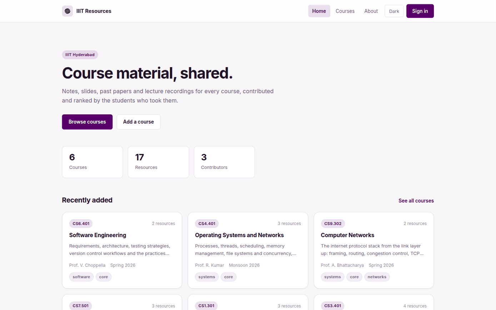
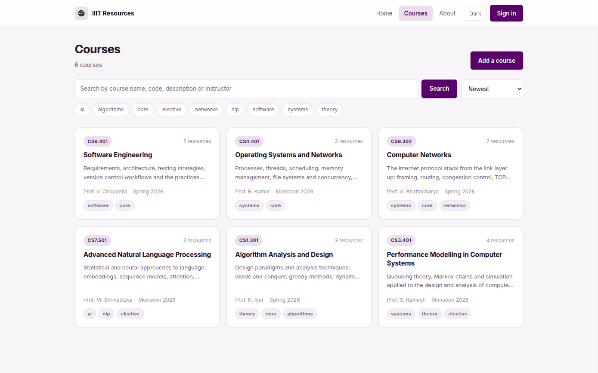
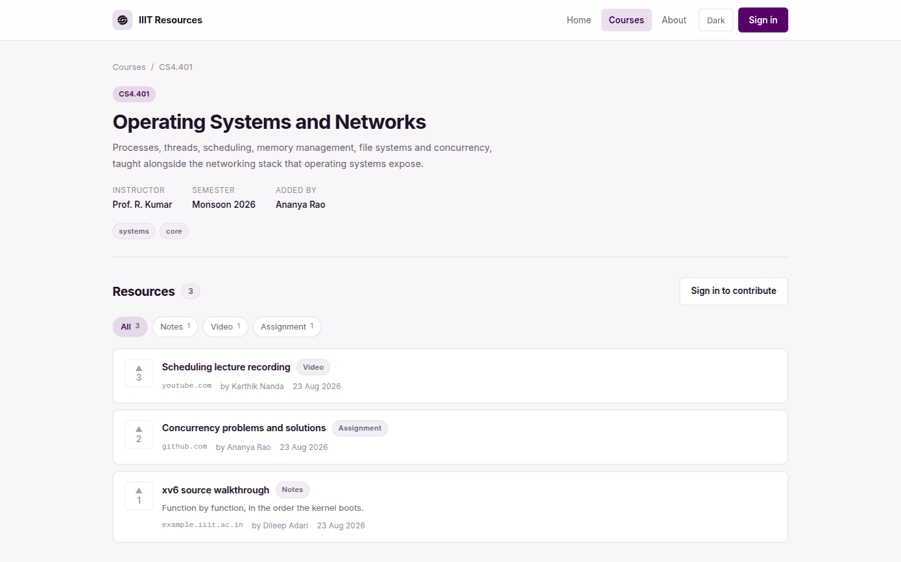
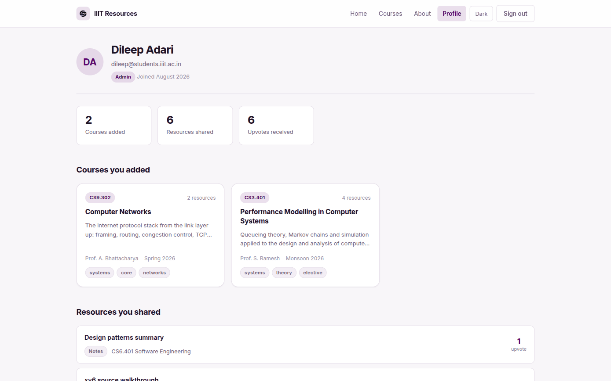
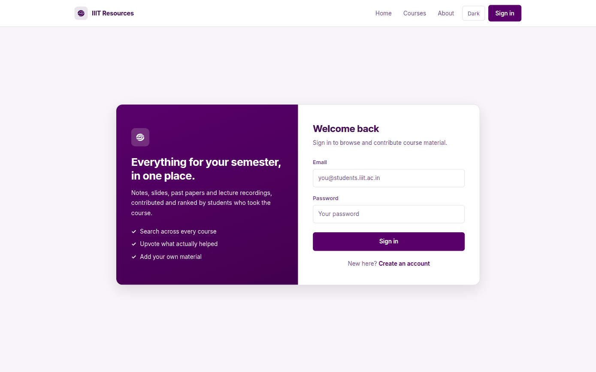
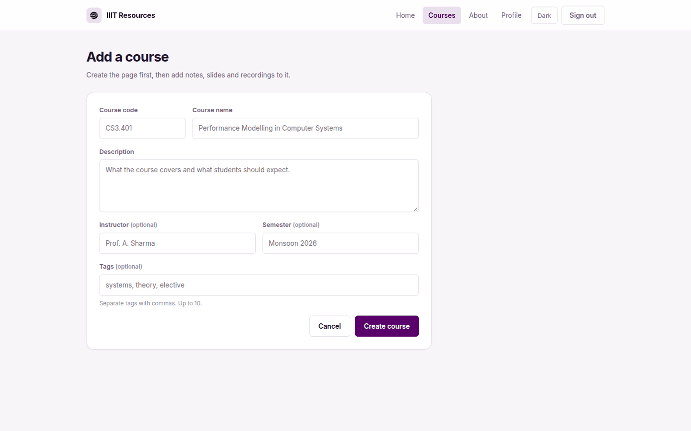
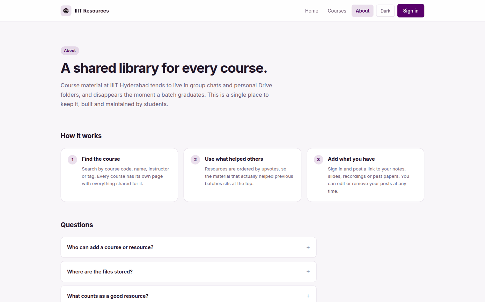
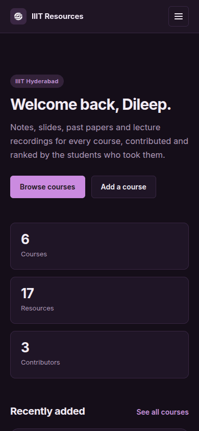
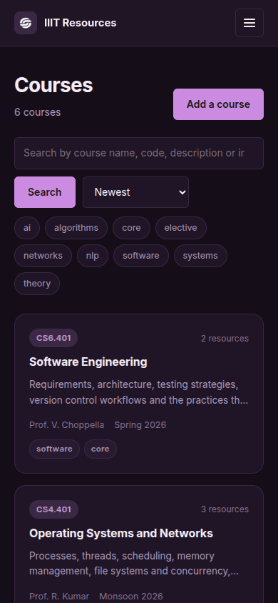
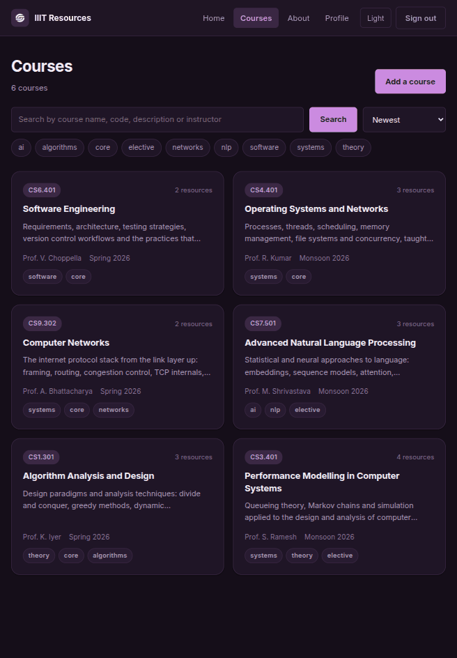

<!-- Generated from README.md by scripts/build-light-readme.mjs. Do not edit by hand. -->

<div align="center">

<picture>
  <source media="(prefers-color-scheme: dark)" srcset="./docs/assets/adk_dev_logo_light.png">
  
</picture>

# IIIT Resources

**A shared library of course material for IIIT Hyderabad, ranked by the students who actually used it.**


<br>


<br><br>

[](https://github.com/Dileepadari/NeverMind-HACKIIITH/actions/workflows/ci.yml)

**[Developer documentation](./DEVDOC.md)** &middot; [Screenshots](#screenshots) &middot; [Running it locally](#running-it-locally)

<p><b>Light mode</b> &middot; <a href="./README.md">View this page in dark mode</a></p>

</div>

---

Students add a page for a course, then post links to the notes, slides,
recordings and past papers that helped them. Everything is ranked by upvotes, so
the material that actually worked for previous batches sits at the top.

The platform stores links, not files. Your material stays wherever you already
keep it: Drive, GitHub, YouTube or a course page.

## Screenshots

This page shows **dark mode**; the same gallery in light mode is at
**[README-light.md](./README-light.md)**.

| | |
|---|---|
| **Home** <br> What the library holds, and what was added recently <br><br>  | **Courses** <br> Search by name, code, description or instructor, and filter by tag <br><br>  |
| **A course** <br> Everything shared for it, ordered by upvotes and filterable by type <br><br>  | **Your profile** <br> What you added, what you shared, and the upvotes it earned <br><br>  |
| **Sign in** <br> Browsing needs no account; contributing does <br><br>  | **Add a course** <br> Create the page first, then hang resources off it <br><br>  |

<p align="center"><b>About</b> &middot; why the library exists, and the rules of the road</p>
<p align="center"></p>

### Responsive

Captured at 390x844 and 820x1180. No horizontal overflow at either width.

| Mobile, home | Mobile, courses | Tablet, courses |
|---|---|---|
|  |  |  |

## What you can do

**Browse without an account.** Anyone can search courses, open a course page and
follow its resources. Signing in is only needed to contribute or vote.

**Search and filter courses.** Search matches course name, code, description and
instructor. Tag chips narrow the list further, and results can be sorted by
newest, most resources, name or course code.

**Open a course.** Each course page shows the instructor, semester, tags and
everyone's shared material, ordered by upvotes. Resources can be filtered by
type: notes, slides, video, assignment, past paper, book or link.

**Contribute.** Add a course page if one does not exist yet, then post resources
to it. Every post is credited to you.

**Upvote.** One vote per person per resource, and you can take it back. Votes
decide the order resources appear in.

**Manage your own posts.** You can edit or delete any course or resource you
added, from the course page or from your profile. You cannot change anyone
else's.

**Track your contributions.** Your profile shows the courses you added, the
resources you shared, and how many upvotes your material has received.

**Light and dark.** The theme follows your system setting and can be switched
from the header. Your choice is remembered.

## Roles

| Role | Can do |
|---|---|
| Visitor (signed out) | Browse and search courses, read resources |
| Student | Everything above, plus add courses and resources, vote, and edit or delete their own contributions |
| Admin | Everything above, plus edit or delete anyone's course or resource, for moderation |

Accounts are created as Student. Admin is set directly in the database.

## A typical flow

1. You are looking for material for CS9.302 Computer Networks.
2. Search `networks` on the Courses page, or filter by the `networks` tag.
3. Open the course. The Wireshark lab walkthroughs are at the top because they
   have the most upvotes.
4. Follow the link, use the notes, and upvote them so the next person finds them
   faster.
5. You have your own TCP notes that are not there yet. Sign in, press **Add a
   resource**, paste the Drive link, pick **Notes**, and save.
6. Your profile now shows the resource, and its upvote count as people find it.

## Running it locally

Requires Node 20.19+ and Docker.

```bash
npm install
cp .env.example .env     # then set NEXTAUTH_SECRET
npm run db:up            # starts PostgreSQL in Docker
npm run db:push          # creates the tables
npm run db:seed          # loads sample courses and users
npm run dev
```

The app runs at http://localhost:3000.

**`npm run db:seed` deletes every row before it writes**, and it refuses to run
against anything but a local database for that reason. Pointing `DATABASE_URL`
at a real deployment and seeding it would destroy the data and leave behind an
administrator whose password is published below. Override with `SEED_FORCE=1`
only if you mean exactly that.

The seed creates three accounts, all with the password `password123`:

| Email | Role |
|---|---|
| dileep@students.iiit.ac.in | Admin |
| ananya@students.iiit.ac.in | Student |
| karthik@students.iiit.ac.in | Student |

Setup details, architecture and deployment are in [DEVDOC.md](DEVDOC.md).

## License

MIT. See [LICENSE](./LICENSE).
